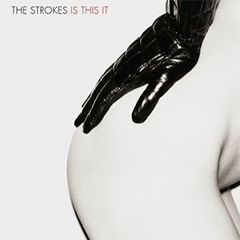
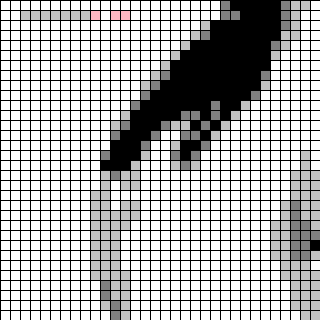

# PixelPlates - Turn Album Covers into Pixel Art

PixelPlates turns square images into pixel art for building album covers with 1x1 plates/blocks. Choose the colors you have and PixelPlates will show the pixel art and tell you how many of each color you need.

PixelPlates can also be used for other pixel art projects, mosaics, patterns and crafts beyond album covers.

## Example

<p align="center">
  
  &nbsp;&nbsp;<strong>→</strong>&nbsp;&nbsp;
  
</p>

## How to use it

1. Install Python and Pillow:

   ```bash
   python3 -m pip install Pillow
   ```

2. Put a **square** image in the `input` directory.

3. In `main.py`, add (1) its path, (2) your custom color palette that maps color names to RGB values, (3) how many pixels you want per edge:

   ```python
   image_path = "input/my_image.png"
   color_palette = { "black": (0, 0, 0), "white": (255, 255, 255), "grey": (128, 128, 128) }
   pixels_per_edge = 64

   pixel_artify(image_path, color_palette, pixels_per_edge)
   ```

4. Run the program:

   ```bash
   python3 main.py
   ```

The generated image is saved in `output/<image_name>/`. The terminal also prints each palette color from most to least used, making it easy to calculate how many 1x1 plates/blocks you will need.
